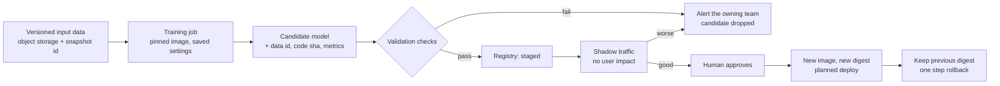
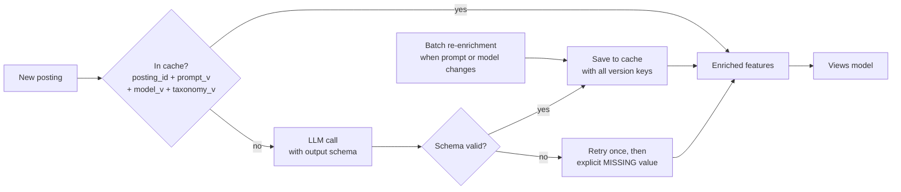
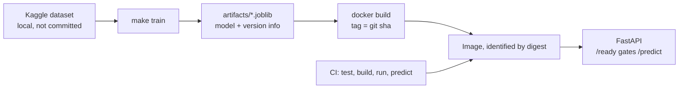
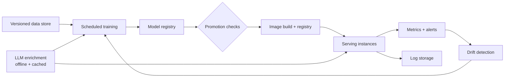

# Architecture notes

I inherited a working FastAPI service and an sklearn model. This file explains
what I found, what I changed, what I did not build on purpose, and how
retraining and LLM enrichment would fit later.

The timebox was 4-6 hours. Most of it went to the baseline and the delivery
pipeline. Sections 5 and 6 are design only, not code.

---

## 1. Summary

| | before | after |
|---|---|---|
| `age_days` when serving | always **−885**, the same for every posting | measured from the request time |
| offline R² (`views`) | 0.048 (random split) | **−0.023** (time split) |
| tests | 1 test, needed a 504 MB download | **28 tests, 0.7 s, no dataset** |
| container shutdown | SIGTERM ignored, killed after timeout | **0 s**, clean shutdown |
| container user | root | normal user, cannot change the model file |
| bad model file at start | process crashes | process stays up, `/ready` returns 503 and says why |

The second row looks like a step back. It is not. The random split was making
the score look better than it was. The real result is that this model is
**worse than just predicting the average**. I explain this in section 3.

---

## 2. Findings

Sorted by how much they matter. I reproduced each problem before fixing it. For
each fix there is a test, and I checked that the test fails when I put the bug
back.

### #1 - `age_days` is wrong when serving (fixed)

`age_days` is `reference_time − posting_listed_time`.

When training, the reference time is the newest posting in the dataset. The old
code **saved that reference time inside the model file** and used it again when
serving.

The newest posting in the dataset is **2024-04-20**. Every request comes later
than that date, so the result becomes negative:

```
2024-04-20  −  a posting listed today  =  −885 days
```

During training the model only saw ages from **0 to 136 days**. The trees learn
rules like "is age below 12 days?". Both −885 and −795 are below every rule, so
they follow the same path through the trees and give the same answer.

I measured this with the real model file:

| posting age | `views` OLD | `views` NEW | `views_per_day` OLD | `views_per_day` NEW |
|---|---|---|---|---|
| 0 days | 5.73 | 5.73 | 3.98 | 3.98 |
| 5 days | 5.73 | 46.01 | 3.98 | 61.66 |
| 30 days | 5.73 | 28.83 | 3.98 | 40.46 |
| 90 days | 5.73 | 28.83 | 3.98 | 132.10 |

**The OLD column never changes.** The model learned from `age_days` during
training, but when serving the value was always the same, so the feature gave
no information. Predictions were 5 to 33 times off, depending on the age.

Nobody noticed this because there was no error. The output looked normal. And
at age 0 both columns give the same number, so a quick test with a new posting
passes.

**Fix:** `predict_views` now uses the request time. `snapshot_ms` stays in the
model file, but only as a record of the training run. Ages are also cut at
zero. This does nothing during training and protects the model when serving.

### #2 - Random split on time-ordered data (fixed)

`train_test_split` shuffled the rows. The postings are ordered by time, so the
model trained on rows that are newer than its own test set. Results on 40k
rows:

| split | MAE | R² |
|---|---|---|
| random | 10.15 | 0.048 |
| time-based | 12.19 | −0.023 |

**Fix:** keep the newest 20% as the test set. The model file now stores
`split_time_ms`, the time where the test set starts. Later this lets us check
if a new model beats the old one on data after that date.

**Known limitation, not fixed.** `snapshot_ms` is still the maximum over the
whole dataset. So training rows are aged against a reference time that includes
the test period, and the offline numbers above stay a little optimistic. I left
it as it is. Ages are cut at zero, so if I used only the training data for the
reference, every test row would get age 0 and the evaluation would mean
nothing. The honest fix is to re-run the whole feature build per split, which
is more than this timebox allows.

### #3 - No pinned versions, and a model file with no version info (fixed)

Two versions of Python were in play. The Dockerfile used `python:3.12-slim`.
`pyproject.toml` said `requires-python = ">=3.10"`, and the local environment
was 3.10. So the code was written and tested on one Python and shipped on
another. Nothing failed, but the tested set of packages was not the set that
ran in the image.

I pinned everything to 3.10: the base image, `requires-python`, and the lock
file. One version everywhere, and the upgrade to a newer Python becomes a
planned task instead of a surprise. Python 3.10 reaches end of life in October
2026, so that task has a date.

All dependencies also used `>=`. The model file did not record which sklearn
version created it. sklearn pickle files do not always work across sklearn versions.
When they do not match, sklearn gives a **warning, not an error**, and then the
service can return different predictions.

**Fix:** `requirements.in` goes through `pip-compile` into `requirements.txt`.
The image installs `requirements.txt` first, then runs `pip install --no-deps .`
so the package cannot change the versions. The model file now stores
`sklearn_version`, and the service **checks it at startup**. If a model file
does not say which version made it, the service refuses to use it. Without this
we cannot verify rollbacks or keep code and model separate.

### #4 - CI could not run without the dataset (fixed)

The only test read `data/postings.csv`. That file is 504 MB, needs Kaggle
credentials, and we cannot share it.

A small fixture does not work directly. `TruncatedSVD(n_components=50)` needs
more TF-IDF features than a small vocabulary produces, so it fails.

**Fix:** the pipeline settings are now arguments instead of fixed numbers, and
`views_model.synthetic` generates postings with enough vocabulary. The test
suite passes when I rename the `data/` folder away.

### #5 - `/metrics` used a reserved name (fixed)

It returned *training* metrics. Every Prometheus setup expects `/metrics` to
return runtime metrics. I renamed it to `/model-info`, so the normal path is
free for later.

### #6 - `was_relisted` is probably leakage (documented, not fixed)

We do not know if a posting will be relisted at the moment it is posted. Also,
a posting may be relisted *because* it got few views. So this feature may
contain the answer we are trying to predict.

I did not remove it. Removing it changes the model, and model quality is not
what this task measures. I am flagging it for the team that owns the model.

---

## 3. Decisions and tradeoffs

**Show the honest number.** The time split made R² negative. Keeping the random
split would look better but would mean nothing. The real result is that this
baseline does not beat the average on a fair test. The product team needs to
know this before anyone builds on top of it.

**What question does the model answer?** `views` is a total count. A new
posting has almost no views, so the model correctly predicts almost zero. This
is true but not useful for someone who asks "how will this posting do?". That
question needs `views_per_day × expected number of days`. The two models are
not the same thing and the caller must choose. If I owned this service, the API
would take a number of days and would not return raw `views`.

**Not ready is better than dead.** If the model file is broken, the service
could crash. That is simple, and the orchestrator would restart it. I chose the
other option: the service starts, `/ready` returns 503, and the answer says
which check failed. A crash loop only tells the operator that something is
wrong. This tells them what is wrong.

`/health` still returns 200 when the model is broken, because it answers a
different question: is the process alive.

**The model file is inside the image.** A new model means a new image and a new
digest. The other option is to download the model at startup. That allows model
updates without a rebuild, but then "which model is running?" becomes a runtime
question instead of a property of the deployment. We have one model and no
retraining schedule yet, so putting it in the image is simpler and correct for
now. Section 5 explains when this should change.

**The digest is the identity. The tag is only a pointer.** The tag comes from
`git describe --always --dirty` and tells you which commit built the image.
Everything else goes into **OCI labels**: commit, source repo, build time, and
which artifact was used. Labels can be queried later. A long tag string cannot.

If the working tree has uncommitted changes, the tag ends with `-dirty`, so
nobody can confuse it with a reproducible build. CI always builds from a clean
checkout, so a `-dirty` tag can only come from a developer machine.

**Synthetic test data, not a sample of the real data.** A real sample would look
more realistic. But we would have to store it, version it, and check the
licence. Generated data costs nothing and is the same on every run. The tradeoff
is that these tests check correctness, not model quality. Model quality is
checked separately with real data, by whoever runs `make train`.

---

## 4. Delivery and operations

### What is implemented

Every command in the README is a `make` target. `make install`, `make test`,
`make demo-artifact`, `make docker-run`, `make docker-smoke`. Running `make`
with no target prints the list with a short description for each one.

This is not only for convenience. A shell command copied into a README goes
out of date quietly, and nobody notices until a new person cannot start the
project. A target is used by CI and by people, so it breaks loudly when it
stops working. The Makefile also holds the image name, the tag rule and the
port in one place, so the same values are used everywhere.

CI (`.github/workflows/ci.yml`) runs the tests, builds the image, starts the
container, waits for `/ready`, and then sends a real prediction request and
checks the answer.

It waits for `/ready` and not for the port. An open port only means uvicorn
started. `/ready` means the model loaded and can produce a prediction.

Container: the process runs as a normal user that does not own the model file,
so it can read the model but not change it. `exec` makes uvicorn PID 1, so it
receives SIGTERM. I measured this: `docker stop` now finishes in **0 seconds**
with a clean shutdown in the logs. Before, Docker waited for the timeout and
then killed the process.

### Publishing and identifying images

Build the image once and promote the same digest between environments. Never
rebuild for the next environment. A rebuild produces a different artifact, even
if the inputs look the same.

```bash
docker push $REGISTRY/views-model:$GIT_SHA      # prints digest: sha256:...
docker run  $REGISTRY/views-model@sha256:<digest>
```

I tested this locally with a `registry:2` container. Push and run by digest both
work with no cloud account.

**Tag immutability is a registry setting, not a Docker feature.** On ECR it is
`imageTagMutability=IMMUTABLE` on the repository. Docker itself will always let
you move a tag. This is the part I documented instead of implementing, because
no local tool can show it.

### Deploy and rollback

Deployments are **planned, not on demand**. Unplanned deploys give a small gain
in speed and cost you incidents at night. There is still a fast path for real
emergencies, but it needs approval and it stays an exception.

Rollback means deploying the previous digest again. Not `:latest`. A tag that
moves is not a rollback plan, and mixing up `:latest` between dev and prod is a
mistake I have seen happen.

**Rolling back code and model separately** is harder, because today they are one
artifact. The answer is a compatibility rule instead of two separate releases:

- new serving code must work with the previous model
- the previous model must still work with the new code

`schema_version` inside the model file is the check. At startup the service
refuses a model file that does not match the running code. To break the rule
you must change `schema_version` on purpose, which forces the discussion before
the release instead of during an incident.

### Model files and permissions

Model files are build output. We never commit them. `artifacts/` is in
`.gitignore`. In production they live in object storage with versioning turned
on, and a registry records which build produced which model.

Each role gets only what it needs:

| role | permission |
|---|---|
| CI build | write to the image registry, read training data |
| serving container | **read only** on the model file, no registry credentials |
| engineers | read model files and metrics, no production deploy |
| deploy owner | promote a digest from one environment to the next |

The container already enforces its part. The process runs as a user that does
not own `/app/artifacts`, so it can read the model and cannot change it.

### Monitoring

Four things, in this order:

1. **Readiness** - `/ready` for every instance. A pod that never becomes ready
   is the most likely deployment problem and the cheapest one to see.
2. **Errors** - the 5xx rate, and separately the 503 rate. They mean different
   things. A 503 means the model did not load. A 500 means the request handling
   failed.
3. **Latency** - p50, p95 and p99 on `/predict`, grouped by batch size. The
   batch limit (`MAX_BATCH_SIZE`, default 500) puts a ceiling on the worst case.
4. **Resources** - mostly memory. The model file holds two fitted pipelines and
   memory should stay flat after startup. If it grows, something leaks.

**Alert on metrics. Investigate with logs.** Metrics tell you something is
wrong. Logs tell you what happened. Exceptions go to an error tracker such as
Sentry. That is a different tool from log storage and should not do both jobs.

The most useful model signal is the **distribution of predictions**. Finding #1
produced no errors and no latency change. What it did produce was predictions
that stopped varying. Watching the spread of predictions would have caught it.
Drift on input features (PSI or KS) is the next layer after that.

### What I did not build, and why

| item | why not now | when to add it |
|---|---|---|
| JSON logging | uvicorn text logs are readable at this size | as soon as logs are shipped to a system that parses them |
| Prometheus `/metrics` | nothing scrapes it yet, and the path is now free | first real deployment |
| Startup probe limit | `/health` returns 200 forever, so a pod that can never load the model will sit there unused | any orchestrated deployment |
| Download the model at startup | one model, no retraining schedule | when models are released more often than code |

---

## 5. Retraining design



**Versioned inputs and outputs.** The training data snapshot must not change
after the fact. It needs an id that always points to the same rows. The model
file records the data id, the code commit, the pipeline settings, and the
sklearn version. The last one is already implemented. To rebuild a model six
months later, nothing in this list may be mutable.

*When to add a data versioning tool such as LakeFS: when more than one person
produces training data, or when we need to rebuild a model from data that has
changed since. Before that, an immutable S3 prefix plus a saved id is enough.*

**Validation and promotion rules.** A new model is promoted only if all of these
are true:

1. It beats the current model on a **test set after `split_time_ms`**, by an
   agreed margin. Not on the old model's training data. That measures nothing.
2. It passes a fixed set of golden cases in CI. These say "the model still does
   the job it was built for".
3. Its prediction distribution is close enough to the current model. A model
   with better average error but no variation is a step back, not forward.
4. Startup validation passes: version, feature list, smoke prediction.

If any check fails, the candidate is dropped and the team is notified. It never
quietly keeps the old model without somebody knowing the retrain failed.

**A human approves first.** Retraining runs on a schedule. Promotion does not.
Automatic promotion is fine later, after we have seen these checks catch a real
problem. A check that has never fired is a check nobody should trust yet.

**Ownership and alerts.** One team owns this, named in the runbook. Failed
checks and failed training runs page that team. If retraining has not run inside
its expected window, that is also an alert. A scheduler that quietly stopped is
the failure that stays hidden longest.

*When to add a model registry such as MLflow: when more than one person trains
models, or when "which model is in production and what made it" can no longer
be answered from `/model-info` plus a digest.*

*When to add an orchestrator such as Airflow: when retraining has several
dependent steps - enrichment, feature build, train, validate - that need their
own retries and backfills. One scheduled job does not need a DAG.*

---

## 6. LLM feature enrichment

The idea: use a hosted LLM to read the title and description and return
structured fields (job family, seniority, skills, work arrangement, content
quality). These become inputs to the views model and should help cold start.



**Where it runs.** Offline, when the posting arrives. **Never inside
`/predict`.** An LLM call in the request path adds seconds of latency and puts
an external service, with its own rate limits and outages, in the serving path.
Enrichment writes to a cache. The model reads whatever the cache holds.

**Caching.** The cache key is `(posting_id, prompt_version, model_version,
taxonomy_version)`. All four are needed. If any of them changes, the output
changes. A cache that ignores this will quietly serve features made by a prompt
that nobody runs any more.

**Output validation and fallback.** Every response is checked against a schema.
Taxonomy fields use fixed lists of allowed values. If the response is invalid,
we retry once. If it fails again, we write an **explicit missing value that the
model was trained to handle**. We do not invent a zero at serving time. That
would be finding #1 again: a value the model never saw during training. When
enrichment is not available, the service must keep working the way it does
today.

**Versioning and train/serve consistency.** This is the part most likely to
break. A prompt change is a change in model behaviour. So prompts live in git,
have a version, and changing one is a deployment, not an edit.

When the prompt, the provider, or the taxonomy changes, either:

- the training data is **enriched again with the new version** before any model
  trained on it is promoted, or
- the feature version is pinned and the old enrichment is kept until the next
  retrain.

What must never happen: a model trained on `prompt_v1` features receiving
`prompt_v2` features. That is the same bug as finding #1, one level up, and it
would be just as silent.

**Evaluation.** A few hundred postings labelled by people, kept fixed. We
measure the enrichment against them field by field. This set never changes. If
it changes, every earlier comparison becomes useless.

A new prompt or a new provider must beat the current one on this set before it
ships. It must also improve the **views model**. Better extraction does not
automatically mean better predictions, so both are measured.

**Latency, cost, privacy, monitoring.**

- *Latency*: not in the serving path by design. What matters is ingest
  throughput and cache hit rate.
- *Cost*: controlled by the cache and by never enriching the same posting
  twice. We track tokens per posting and set a budget. A prompt change that
  doubles the token count should be a decision, not a surprise.
- *Privacy*: this needs care. **Job descriptions can contain salary ranges,
  names of hiring managers, and contact details.** Raw description text and raw
  LLM responses must not go into logs or traces. We log the feature values,
  whether each field was valid, latency, token counts, and a hash of the input.
  Not the input itself. The cache holds derived features with a retention
  period and is included in deletion requests.
- *Monitoring*: schema failure rate, cache hit rate, missing rate per field,
  and drift in each extracted field. If a provider changes the model behind the
  same name, the field distributions move first.

---

## 7. Now and target

**Now - everything in this repository:**



**Target - with the condition for each addition:**



| component | add it when |
|---|---|
| Versioned data store | more than one person produces training data |
| Model registry | more than one person trains models |
| Scheduled training | data changes faster than people retrain by hand |
| Metrics and alerts | first real deployment |
| Log storage | more than one person reads logs, or more than one instance runs |
| Drift detection | after one full retraining cycle, because thresholds need a baseline |
| Orchestrator | retraining has steps that need their own retries |
| LLM enrichment | cold start is measured and shown to be the biggest source of error |

None of these should be added before its condition is true. Each one is another
system to run, upgrade and debug.

---

## 8. Roadmap

**Short - next week**

1. JSON logging to stdout, with a request id and the latency of each call.
2. A real Prometheus `/metrics`: request count, latency histogram, and a summary
   of the prediction distribution. The path is free now.
3. A startup probe limit, so a pod that can never load the model restarts
   instead of sitting there.
4. Decide the horizon question: stop returning raw `views` and accept a number
   of days instead.
5. Remove `was_relisted`, measure the effect, and give the number to the model
   owners.

**Medium - next quarter**

1. Immutable training snapshots with the id saved in the model file.
2. Scheduled retraining with the checks from section 5. Promotion stays manual.
3. A model registry, once a second person starts training models.
4. Drift monitoring on inputs and predictions, with thresholds taken from the
   first retraining cycle.

**Long - when the scale needs it**

1. Orchestrated retraining with several steps, retries and backfill.
2. LLM enrichment, offline and cached, behind the evaluation gate in section 6.
3. Automatic promotion, after the checks have caught a real problem at least
   once.

